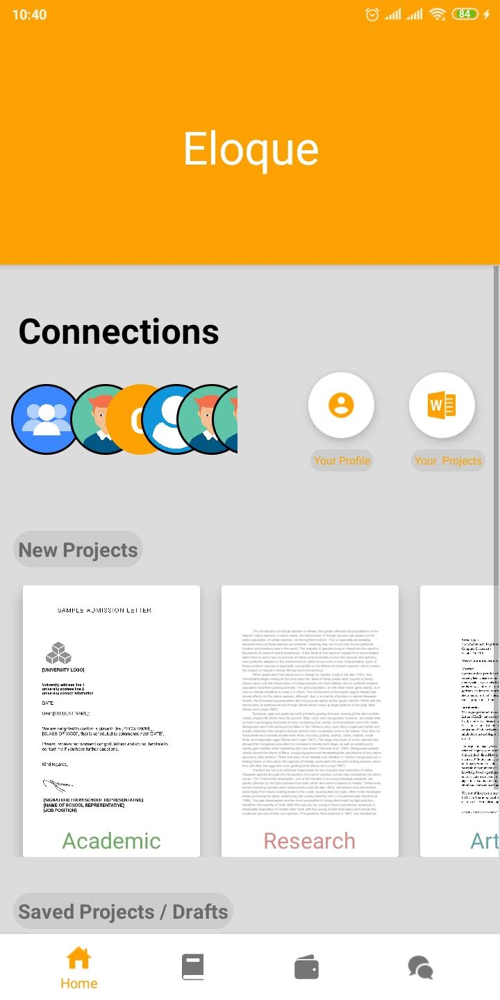
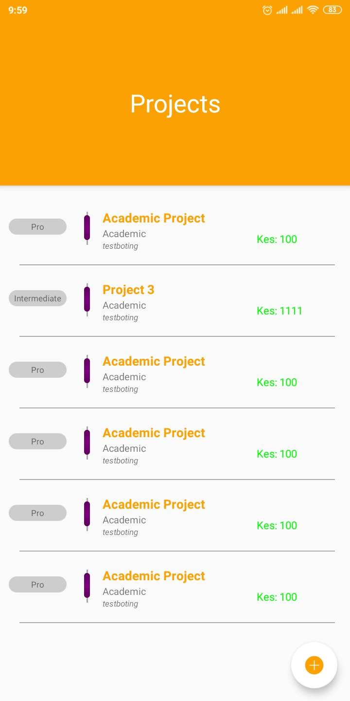

# Eloque

## About Eloque
* Eloque is a Android based Mobile Application that lets its users post and get to do freelance writing and other Skills like Photoshop. It is ideal for people who needs aricles written, review,research and academic work. Eloque offers a flevible payment Option for it Clients too and offers a more localised writing experience.

## Author
 Brian Protas Odida.

* Email `bryodiiidah@gmail.com`
* Github `https://github.com/OdidaProtas`
* LinkedIn `https://www.linkedin.com/in/brian-odida-78797318a`

## Technologies Used
1. Java
1. Android Libraries
1. Figma for design
1. extensible Markup Language Xml

## Known Bugs
* The Application is still in developent so some feature are are still lacking. And some may not work as expected.

## SetUp and Installation.
* Requirements

        1.Java Sdk Installed

        2. Android Studio IDE

* SetUp
  1. Clone this repository by adding this command to your terminal, `git clone https://github.com/OdidaProtas/Eloque.git`

  1. Open the folder in android Studio and run the application to  get a build. Connect Your device Via Usb and the application will be installed in your phone.

## License

Proprietary (C) 2019 [Odida Protas](github.com/OdidaProtas)
